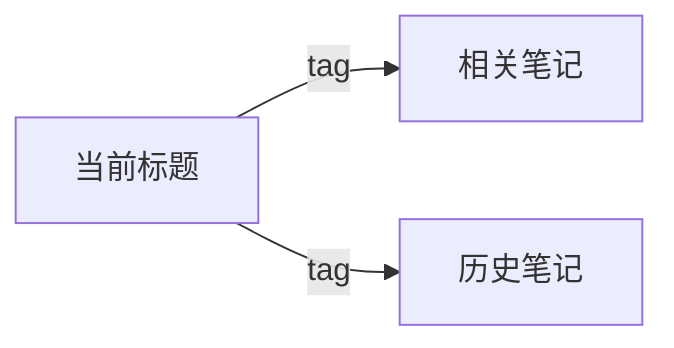

# Learn / 学习 v3.5

> **一条链接 → 全增强知识卡片。** AI 分类 + 亮点提取 + 深度思考 + 术语解释 + 评分 + 知识图谱 + 闪卡 + 章节总结 + 多知识库导入。双速自适应，零配置。
>
> **One link → one enhanced knowledge card.** AI classification, highlights, deep thinking, glossary, rating, knowledge graph, flashcards, chapter summaries, and multi-KB import. Dual-speed auto-adaptive, zero config.

## 触发规则

用户消息含 **`学习`**（如"学习一下""帮我学习"）或 **`learn`** + 链接时自动触发。无链接则提示提供链接。独立词"总结"不触发本技能（走总结功能），互不干扰。

## 前置条件

执行前检查以下依赖。缺失时按降级规则运行：

| 依赖 | 用途 | 降级 |
|------|------|------|
| ffmpeg | 音视频处理 | ❌ 无法继续，报安装命令后终止 |
| yt-dlp | 视频/字幕下载 | ⚠ `pip install yt-dlp` 尝试安装 |
| tesseract | OCR（深度模式） | ⚠ 跳过 OCR 和关键帧 |
| faster-whisper | 音频转录 | ⚠ `pip install faster-whisper` 尝试安装 |
| scenedetect | 关键帧提取（深度模式） | ⚠ 跳过关键帧 |

## 双速自适应决策树

```
收到链接
  ├─ 自判定模式（默认）：
  │   ├─ 播客/RSS/微信/本地.mp3 → 快速（元数据+字幕，~30秒）
  │   └─ 抖音/TikTok/B站/YouTube/本地.mp4 → 深度（元数据+字幕+关键帧+OCR，~3-10分）
  ├─ 显式指定： "学习 快速 <链接>" 或 "学习 深度 <链接>"
  ├─ 风格控制（可选）：
  │   ├─ "简单点" → style=beginner（加类比、减术语）
  │   ├─ "详细点" → style=detailed（章节扩至100-150字）
  │   └─ 默认     → style=balanced
  ├─ 第1步：平台识别（正则匹配 URL）
  ├─ 第2步：按平台路由提取命令
  ├─ 第3步：读取提取结果（summary.md）
  ├─ 第4步：AI 综合分析（单轮输出全部 JSON：分类+亮点+深度思考+术语+评分+闪卡+总结）
  ├─ 第5步：知识图谱（扫描历史条目，按 tags 匹配生成 Mermaid 关联图）
  ├─ 第6步：组装增强 Markdown（调用 scripts/assemble_md.py，含封面图+全部字段）
  ├─ 第7步：导入知识库（调用 scripts/kb_router.py，自动检测）
  └─ 第8步：汇报结果
```

## 平台 → 提取命令

| 平台 | 快速/深度 | 命令 |
|------|-----------|------|
| 抖音 | 深度 | `python scripts/extract_douyin.py <url> --frames` |
| TikTok | 深度 | `python scripts/extract_douyin.py <url> --frames` |
| B站 | 深度 | `yt-dlp --write-subs <url>` → whisper 兜底 |
| YouTube | 深度 | `yt-dlp --write-subs <url>` → whisper 兜底 |
| 播客/RSS | 快速 | `python -m hearsay ingest <url>` |
| 微信 | 快速 | `python scripts/extract_webpage.py <url>`（feedgrab 兜底） |
| 小红书 | 快速 | `python scripts/extract_webpage.py <url>`（feedgrab 兜底） |
| 通用网页 | 快速 | `python scripts/extract_webpage.py <url>`（readability + markdownify） |
| 本地文件 | 自动 | `whisper <file> --model base` |

> **环境检测**：执行前检查 ffmpeg / yt-dlp / whisper / tesseract。降级规则：
> - 缺 tesseract → 跳过 OCR 和关键帧，继续转录
> - 缺 yt-dlp → 尝试 `pip install yt-dlp`，失败则提示手动下载
> - 缺 ffmpeg → 无法提取，报安装命令后终止

---

## 执行流程

### 步骤 1：平台识别

按优先级依次匹配 URL：

```
抖音:   (?:v\.douyin\.com|www\.douyin\.com/video|www\.iesdouyin\.com|douyin\.com/user/.*modal_id)
TikTok: (?:tiktok\.com|vm\.tiktok\.com)
B站:    bilibili\.com/video/
YouTube: (?:youtube\.com/watch|youtu\.be/)
微信:   mp\.weixin\.qq\.com
小红书: xiaohongshu\.com
播客:   \.(?:xml|rss)(?:\?|$) | /feed/?$ | podcast
本地:   \.(?:mp4|mkv|avi|mov|mp3|wav|flac|m4a|webm)$
```

### 步骤 2：内容提取

按上表命令执行提取。深度模式产物结构（`learn-output/<id>/`）：

```
├── summary.md       ← 元数据+转录+关键帧引用+OCR文本（供AI分析，不入final.md）
├── transcript.txt   ← 原始转录（AI内部使用，final.md 仅输出提炼后的知识点）
├── video.mp4
├── audio.wav
└── frames/
    ├── scene_001.jpg
    ├── scene_002.jpg
    └── ocr.txt
```

> **输出原则**：final.md 仅包含 AI 提炼后的知识点（摘要/亮点/思考/术语/评分/图谱/闪卡/章节总结），**不含原始全文转录**，以控制输出体积和 API 成本。

### 步骤 3：读取提取结果

从 `summary.md` 解析：`title`、`platform`、`author`、`duration`。如有封面图 URL 一并提取。

> 注意：原始转录仅用于 AI 分析，不进入 final.md 最终输出。

### 步骤 4：AI 综合分析（单轮输出）

> **一次调用完成所有 AI 分析**，加速管线。基于完整转录内容，输出以下全部 JSON：

<details>
<summary>📦 输出格式总览（点击展开）</summary>

```json
{
  "category": "主题分类",
  "tags": ["标签1", "标签2", "标签3"],
  "summary": "3-5句精华摘要，覆盖核心观点和关键发现",
  "highlights": [
    {"time": "MM:SS", "description": "核心要点+简短原因说明（25-50字）"},
    {"time": "MM:SS", "description": "另一要点+机制/案例解释"}
  ],
  "deep_thinking": [
    {"q": "为什么/如果…会怎样/与X对比等问题？", "a": "结合原文+合理推理的深度答案"}
  ],
  "glossary": [
    {"term": "关键术语", "definition": "简明定义说明"}
  ],
  "rating": {"info_density": 4.0, "practicality": 4.5, "clarity": 4.0},
  "flashcards": [
    {"q": "测试关键概念的问题", "a": "信息量大但简洁的答案"}
  ],
  "chapters": [
    {"time": "MM:SS", "title": "章节标题（前加 emoji 🧩⚡⭐🔄⏳ 更佳）",
     "screenshot": "frames/scene_NNN.jpg",
     "summary": "一段完整解释（50-150字），包含核心论点、作者使用的类比/案例、该部分在整体中的定位"}
  ]
}
```

</details>

**各字段质量要求**：

| 字段 | 要求 | 失败→重试 |
|------|------|-----------|
| `category` | 具体分类（如"机器学习"非"科技"），标签3-5个 | 用更长转录重试 |
| `highlights` | 5-10条，**每条含上下文解释**（非标题式），时间戳对应转录位置 | 重新提取 |
| `deep_thinking` | 2-3组Q&A，问题从**用户真实困惑**出发（如"为什么…""如果…会怎样"） | 重新生成 |
| `glossary` | 3-8个真正关键的术语，避免常识词 | 重新提取 |
| `rating` | 三维度评分有区分度（避免全4或全5） | 重新评分 |
| `flashcards` | 转录<500字跳过，否则5张，测理解非琐碎细节 | 重新生成 |
| `summary` | 3-5句覆盖最核心观点 | 重写 |
| `chapters` | 每章一段完整解释（50-150字），**非一句话** | 重写 |

> **风格适配**：根据用户输入调整输出
> - 用户说"简单点" → `chapters` 用更多类比、减少术语、缩至30-80字
> - 用户说"详细点" → `chapters` 扩至100-150字，`highlights` 增至8-10条

**质量自检**：逐字段检查，任一不合格→重试对应字段一次。

### 步骤 5：知识图谱（语义关联）

> 从当前内容中提取 3-5 个**核心概念词**（如"Transformer""Self-Attention"），然后扫描 `learn-output/` 下历史条目的 `tags` 和 `final.md` 标题，匹配规则：
>
> - 核心概念词 ∩ 历史条目 tags 有交集 → 关联
> - 核心概念词 出现在历史条目标题中 → 关联
>
> 最多 5 条关联。输出 JSON：
> `[{"title": "相关笔记标题", "tag": "匹配标签/概念词", "url": ""}, ...]`

**质量**：关联是否合理且有信息量？若完全无关联，留空数组。

### 第6步：组装增强 Markdown（v3.5）

```bash
python scripts/assemble_md.py \
  --title "<标题>" --url "<链接>" --platform "<平台>" \
  --cover-image "<封面图URL>" \
  --author "<作者>" --duration "<时长>" \
  --category "<分类>" --tags "<tag1>,<tag2>" \
  --summary "<AI总结文本>" \
  --highlights '<亮点JSON>' \
  --deep-thinking '<深度思考JSON>' \
  --glossary '<术语JSON>' \
  --rating '<评分>' \
  --chapters '<章节JSON>' \
  --related-notes '<相关笔记JSON>' \
  --flashcards '<闪卡JSON>' \
  --out "learn-output/<slug>/final.md"
```

> 注意：原始转录不入 final.md，仅作为 AI 分析阶段的输入。

增强模板（中英双语，含全部 v3.5 新区域）：

```markdown
	---
title: "{title}"
source: "{url}"
platform: "{platform}"
author: "{author}"
duration: "{duration}"
date: "{date}"
tags: [{tags_yaml}]
category: "{category}"
rating: {rating}
related: [{related_notes_yaml}]
cover_image: "{cover_image}"
---


# {title}

## 📋 Metadata / 元数据
...

## 💡 AI Summary / AI 总结
{summary}

## ⭐ Highlights / 内容亮点
- **[MM:SS]** 核心要点描述 + 原因/机制说明
- **[MM:SS]** 另一个要点 + 背景解释

## 🤔 Deep Thinking / 深度思考
**Q1:** 深入问题？
**A1:** 深度答案

## 📚 Glossary / 术语解释
- **术语名**: 定义说明

## 🌟 Rating / 内容评分
| Dimension / 维度 | Score / 分数 |
|---|---|
| 信息密度 | 4.0 |
| 实用价值 | 4.5 |
| 清晰度 | 4.0 |

> AI 自动评分（1-5 星）/ 你的评分: _____ / 5

## 🤖 AI Classification / AI 分类
- **Category / 主题**: ...
- **Tags / 标签**: #tag1 #tag2 ...

## 🧭 Knowledge Graph / 知识图谱


## 🖼 Chapter Summary / 章节总结
### [MM:SS] 🧩 章节标题

一段完整解释（50-150字），包含核心论点、类比/案例、定位...

## 🃏 Flashcards / 闪卡
...
```

### 第7步：导入知识库

```bash
python scripts/kb_router.py --file "learn-output/<slug>/final.md"
```

自动检测已安装知识库（思源/Obsidian/Logseq/Trilium/Joplin/本地），优先尝试有 API 的，降级到文件复制，本地保存兜底。
强制指定目标：`python scripts/kb_router.py --file "..." --force obsidian`

### 第8步：汇报结果

```
✅ 学习完成 | 📄 {title} | 🏷 {category} | ⭐ {rating} | 🃏 {count}张 | 📥 {import_target} | 🧭 {related}条关联 | 💾 本地路径
```

---

## 配置

参考 `.env.example`（技能目录下）。无需 `.env` 即可作为 AI 技能使用（分类/闪卡/总结由模型在线完成）。

## 参考文档

| 文档 | 内容 | 何时读取 |
|------|------|---------|
| `references/platforms.md` | 各平台提取详情、降级策略 | 特定平台提取出错时 |
| `references/siyuan-api.md` | 思源 API 参考 | 思源导入失败时 |
| `references/troubleshooting.md` | 常见错误排查 | 任何步骤出错时 |
