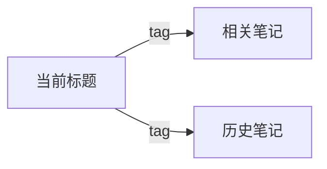

# 输出格式参考

> zhixi-learn 深度模式产物结构和 Markdown 渲染模板。参见 SKILL.md「执行流程」。

---

## 深度模式产物结构

`learn-output/<id>/` 目录内容：

```
├── summary.md       ← 元数据+转录+关键帧引用+OCR文本（供AI分析，不入final.md）
├── transcript.txt   ← 原始转录（AI内部使用，final.md 仅输出提炼后的知识点）
├── video.mp4
├── audio.wav
├── audio_source.mp4 ← 抖音等来源的分离音频流（如有）
├── video_merged.mp4 ← 音视频合并版（抖音等分开发送的场合）
├── extraction.log   ← 提取过程的详细日志（含降级记录）
└── frames/
    ├── scene_001.jpg
    ├── scene_002.jpg
    └── ocr.txt
```

**注意**：
- 原始转录仅用于 AI 分析，不进入 final.md 最终输出
- 若以降级模式运行（缺 tesseract/scenedetect），在 final.md 顶部标注 🟡 Degraded Mode
- 若用了 playwright 兜底（绕过 yt-dlp），在 final.md 标注提取方式

---

## Markdown 模板（final.md）

```markdown
---
title: "{title}"
source: "{url}"
platform: "{platform}"
author: "{author}"
duration: "{duration}"
date: "{date}"
tags: [{tags_yaml}]
category: "{category}"
rating: {rating}
related: [{related_notes_yaml}]
cover_image: "{cover_image}"
extraction_method: "{yt-dlp | playwright | hybrid}"
degraded_mode: "{none | no_ocr | no_frames | no_ocr_frames}"
---


# {title}

## 📋 Metadata / 元数据
...

## ⚙ Extraction Info / 提取信息
- **Method / 方式**: {yt-dlp / playwright / hybrid}
- **Status / 状态**: {full / degraded}
- **Missing / 缺失**: {tesseract, scenedetect, ...}

## 💡 AI Summary / AI 总结
{summary}

## ⭐ Highlights / 内容亮点
- **[MM:SS]** 核心要点描述 + 原因/机制说明
- **[MM:SS]** 另一个要点 + 背景解释

## 🤔 Deep Thinking / 深度思考
**Q1:** 深入问题？
**A1:** 深度答案

## 📚 Glossary / 术语解释
- **术语名**: 定义说明

## 🌟 Rating / 内容评分
| Dimension / 维度 | Score / 分数 |
|---|---|
| 信息密度 | 4.0 |
| 实用价值 | 4.5 |
| 清晰度 | 4.0 |

> AI 自动评分（1-5 星）/ 你的评分: _____ / 5

## 🤖 AI Classification / AI 分类
- **Category / 主题**: ...
- **Tags / 标签**: #tag1 #tag2 ...

## 🧭 Knowledge Graph / 知识图谱


## 🖼 Chapter Summary / 章节总结
### [MM:SS] 🧩 章节标题

一段完整解释（50-150字），包含核心论点、类比/案例、定位...

## 🃏 Flashcards / 闪卡
...
```

---

## 组装命令

```bash
python scripts/assemble_md.py \
  --title "<标题>" --url "<链接>" --platform "<平台>" \
  --cover-image "<封面图URL>" \
  --author "<作者>" --duration "<时长>" \
  --category "<分类>" --tags "<tag1>,<tag2>" \
  --summary "<AI总结文本>" \
  --highlights '<亮点JSON>' \
  --deep-thinking '<深度思考JSON>' \
  --glossary '<术语JSON>' \
  --rating '<评分>' \
  --chapters '<章节JSON>' \
  --related-notes '<相关笔记JSON>' \
  --flashcards '<闪卡JSON>' \
  --degraded-mode '<降级标注: 无OCR/无关键帧>' \
  --out "learn-output/<slug>/final.md"
```
